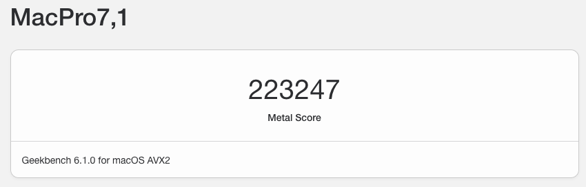

# OpenCore 0.9.4 macOS Ventura Hackintosh
A Hackintosh EFI & guide for macOS Ventura & Sonoma (WIP)
 

# Screenshots:
About this Mac:
 

Geekbench 6 Results:

CPU Scores:
<b>13th Gen Intel® Core i9-13900k</b>

GPU Scores:
<b>ASRock AMD Radeon RX 6800 XT</b>

Highest GPU Score: <b>223247</b>

> [!WARNING]
> I do not take any responsibility and not liable for any damage caused by use of information through this repository.
## Specifications

<table>
  <tbody>
    <tr>
      <td align="left"> Hardware 
        &nbsp;&nbsp;&nbsp;&nbsp;&nbsp;&nbsp;&nbsp;&nbsp;
        &nbsp;&nbsp;&nbsp;&nbsp;&nbsp;&nbsp;&nbsp;&nbsp;
        &nbsp;&nbsp;&nbsp;&nbsp;&nbsp;&nbsp;&nbsp;&nbsp;
        &nbsp;&nbsp;&nbsp;&nbsp;&nbsp;&nbsp;&nbsp;&nbsp;
        &nbsp;&nbsp;&nbsp;&nbsp;&nbsp;&nbsp;&nbsp;&nbsp;
        &nbsp;&nbsp;&nbsp;&nbsp;&nbsp;&nbsp;&nbsp;&nbsp;
        &nbsp;&nbsp;&nbsp;&nbsp;&nbsp;&nbsp;&nbsp;&nbsp;
        &nbsp;&nbsp;
      </td>
      <td align="center">Model 
        &nbsp;&nbsp;&nbsp;&nbsp;&nbsp;&nbsp;&nbsp;&nbsp;
        &nbsp;&nbsp;&nbsp;&nbsp;&nbsp;&nbsp;&nbsp;&nbsp;
        &nbsp;&nbsp;&nbsp;&nbsp;&nbsp;&nbsp;&nbsp;&nbsp;
        &nbsp;&nbsp;&nbsp;&nbsp;&nbsp;&nbsp;&nbsp;&nbsp;
        &nbsp;&nbsp;&nbsp;&nbsp;&nbsp;&nbsp;&nbsp;&nbsp;
        &nbsp;&nbsp;&nbsp;&nbsp;&nbsp;&nbsp;&nbsp;&nbsp;
        &nbsp;&nbsp;&nbsp;&nbsp;&nbsp;&nbsp;&nbsp;&nbsp;
        &nbsp;&nbsp;
      </td>
      <td align="center"> Status 
        &nbsp;&nbsp;&nbsp;&nbsp;&nbsp;&nbsp;&nbsp;&nbsp;
        &nbsp;&nbsp;&nbsp;&nbsp;&nbsp;&nbsp;&nbsp;&nbsp;
        &nbsp;&nbsp;&nbsp;&nbsp;&nbsp;&nbsp;&nbsp;&nbsp;
        &nbsp;&nbsp;&nbsp;&nbsp;&nbsp;&nbsp;&nbsp;&nbsp;
        &nbsp;&nbsp;&nbsp;&nbsp;&nbsp;&nbsp;&nbsp;&nbsp;
        &nbsp;&nbsp;&nbsp;&nbsp;&nbsp;&nbsp;&nbsp;&nbsp;
        &nbsp;&nbsp;&nbsp;&nbsp;&nbsp;&nbsp;&nbsp;&nbsp;
        &nbsp;&nbsp;
      </td>
    </tr>
    <tr>
        <td align="left">Motherboard</td>
        <td align="center">ASUS Z790-A GAMING WIFI D4</td>
        <td align="center">	❓ </td>
    </tr>
    <tr>
        <td align="left">CPU</td>
        <td align="center">13th Gen Intel® Core i9-13900k</td>
        <td align="center">	✅ </td>
    </tr>
    <tr>
        <td align="left">RAM</td>
        <td align="center">64 GB ( Corsair DDR4 3600MHz 16GB x 4 )</td>
        <td align="center">	✅ </td>
    </tr>
    <tr>
        <td align="left">GPU</td>
        <td align="center">ASRock AMD Radeon RX 6800 XT ( 16 GB )</td>
        <td align="center">	✅ </td>
    </tr>
    <tr>
        <td align="left">Storage</td>
        <td align="center">Intel SSDPEKNW512GB NVME</td>
        <td align="center">	✅ </td>
    </tr>
    <tr>
        <td align="left">Ethernet</td>
        <td align="center">Intel® Ethernet Contoller I226-V</td>
        <td align="center">	✅ </td>
    </tr>
    <tr>
        <td align="left">Wi-fi</td>
        <td align="center">Intel® Wi-Fi 6E AX211</td>
        <td align="center">	✅ </td>
    </tr>
  </tbody>
</table>

> [!NOTE]
> These are MY custom specifications and it may not work for you & require tweaking.

## Kexts：
> [!IMPORTANT]
> Crucial kexts that are necessary for you to succeed.

1. Lili Kext
   - https://github.com/acidanthera/Lilu/releases [^1]
2. VirtualSMC Kexts
   - https://github.com/acidanthera/VirtualSMC/releases [^2]
3. WhateverGreen
   - https://github.com/acidanthera/WhateverGreen/releases [^3]
4. AppleALC
   - https://github.com/acidanthera/AppleALC/releases [^4]
5. Airportitlwm
   - https://github.com/OpenIntelWireless/itlwm/releases [^5]
> [!IMPORTANT]
> Kexts that are not required.

6. CPUFriend Kext
   - https://github.com/acidanthera/CPUFriend/releases [^6]
7. CpuTopologyRebuild
   - https://github.com/b00t0x/CpuTopologyRebuild/releases [^7]

> [!NOTE]
> After editing anything in your config, it is best to reset your NVRAM. [^8]

## BIOS：

Adding Info here soon :) Thanks!

## Hackintosh Checklist - Whats Working?：
> [!NOTE]
> If anything does't work for you, report the issue here: 
https://github.com/IllSaft/ROG-STRIX-Z790-A-GAMING-WIFI-Intel-i9-13900k-RX-6800-XT-OpenCore-0.9.4/issues
1. OpenCore Booting
    - [x] Correct OS choices shown in OpenCore Menu/GUI
    - [ ] Keyboard shortcuts working (see details below)
        - CMD+V — verbose mode.
    - [x] NVRAM working Verifying if you have working NVRAM
        - Apple -> System Preferences -> Startup Disk (uses NVRAM).
    - [x] Security (especially SIP) use Menu Bar SIP Detector
    - [x] FileVault
    - [x] Multibooting
2. Display
    - [x] Display via HDMI
    - [x] Display via HDMI
    - [x] Display via DisplayPort
    - [x] Display via DVI
    - [x] Resolution
    - [x] Refresh rates
    - [x] Multimonitor displays
3. Graphics Acceleration
    - [x] dGPU dedicated GPU
        - In Terminal: gfxutil -f GFX0 or check in IORegistryExplorer
    - [x] QE/CI (full acceleration requires both Quartz Extreme and Core Image)
        - Check for transparent menu bar and fast smooth UI.
    - [x] VDA (Video Decode Acceleration framework)
        - Hackintool -> System -> System -> VDA Decoder (should show 'fully supported')
    - [x] Metal
        - System Information -> Graphics/sDisplays -> Metal: Supported
        - GLView
        - Geekbench -> Compute -> Metal
4. Audio
    - [x] Audio out (Audio MIDI Setup)
    - [x] Audio in
    - [x] Frontpanel audio connectors
    - [x] Audio over HDMI
    - [x] Audio quality
5. Sleep & Power
    - [x] Manual Sleep (Apple menu -> Sleep)
    - [x] Auto Sleep (System preferences -> Energy Saver)
    - [x] Wake by keyboard
    - [x] Wake by mouse/trackpad
    - [x] Sleep by Press and hold power button for 1.5 seconds
    - [x] Shutdown (from Apple menu)
    - [x] Restart (from Apple menu)
6. CPU
    - [x] CPU Power Management Optimizing Power Management
        - Check with IORegistryExplorer
    - [ ] Temperatures and stability with 100% CPU
        - Use Prime95 Torture Test
7. Disk
    - Test with Blackmagic Disk Speedtest
    - [x] NVMe SSD
     - Write: 878.3 MB/s
     - Read: 1388.5 MB/s
    - [x] SATA SSD
        - Write: 103.4 MB/s
        - Read: 454.1 MB/s
    - [x] TRIM support (System Information -> SATA -> SSD drive) 
    
> [!NOTE]
> Quick Tip: Enabling TRIM support on your Hackintosh:
> To enable trim support, simply open up a Terminal, and type in the following command. 
> <b>sudo trimforce enable</b>

8. Keyboard
    - [x] Option/Command correctly mapped in macOS
        - For PC Keyboards swap in: System preferences -> Keyboard -> Modifier Keys
    - [x] Fn keys working
9. USB
    - Use USBMap
    - Test external drives with Blackmagic Disk Speedtest
    - [x] USB 2 ports
    - [x] USB 2 on USB 3 ports
    - [x] USB 3 and 3.1 ports (check transfer speed during copy)
    - [x] USB C ports
    - [x] Camera (Photo Booth, Facetime, Zoom)
10. Ethernet
    - [x] Gigabit LAN (System preferences -> Network -> Ethernet -> Advanced -> Hardware -> Speed should be 1000baseT)
11. Wifi & Bluetooth
    - [x] Wifi transmission speed (Option Click -> Wifi menu bar icon -> check Tx Rate)
    - [x] Bluetooth devices (trackpad, mouse, keyboard, headset)

> [!IMPORTANT]
> Having issues with AirDrop. Working on a solution. :tada:

    - [ ] AirDrop (test with iDevices)
    - [ ] AirPlay to Mac (macOS Monterey or later, test with iOS 14 or later devices)
        - tap the AirPlay icon on your Apple device to share videos to your Hackintosh
    - [ ] Handoff System requirements for Continuity and Use Continuity which requires macOS Catalina & iOS 13+
    - [ ] Sidecar requires macOS Catalina or later and a compatible iPad using iPadOS 13 or later.
12. OS Features
    - [x] iMessage, FaceTime, App Store, iTunes Store
    - [x] DRM support (iTunes Movies, Apple TV+, Amazon Prime and Netflix, and others)

<h6>Footnotes:</h6>

[^1]: An open source kernel extension bringing a platform for arbitrary kext, library, and program patching throughout the system for macOS.
[^2]: Advanced Apple SMC emulator in the kernel. Requires Lilu for full functioning.
[^3]: A Lilu plugin providing patches to select GPUs on macOS. Requires Lilu 1.5.6 or newer.
[^4]: An open source kernel extension enabling native macOS HD audio for not officially supported codecs without any filesystem modifications. AppleALCU can be used for systems with digital-only audio.
[^5]: An Intel Wi-Fi Adapter Kernel Extension for macOS, based on the OpenBSD Project.
[^6]: A Lilu plug-in for dynamic power management data injection.
[^7]: An experimental Lilu plugin that optimizes Alder Lake / Raptor Lake's heterogeneous core configuration.
[^8]: When the HideAuxiliary option is Enabled, you need to press the Space Bar Key on your Keyboard to show all the other options in the picker.