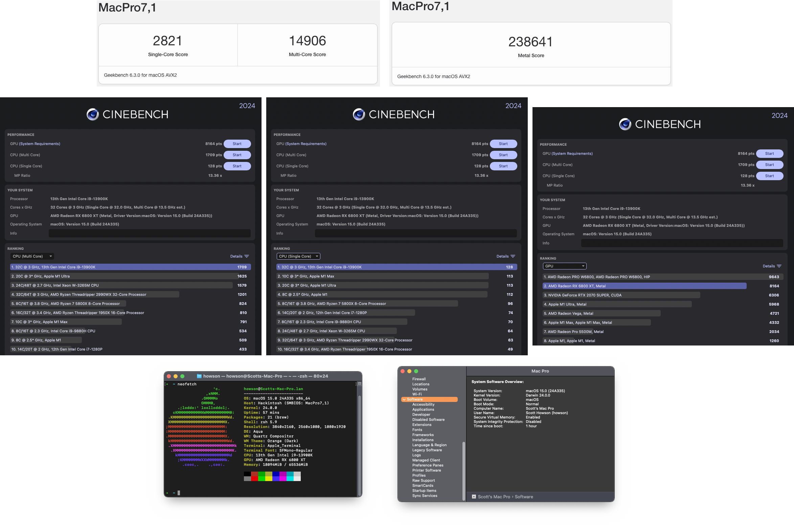
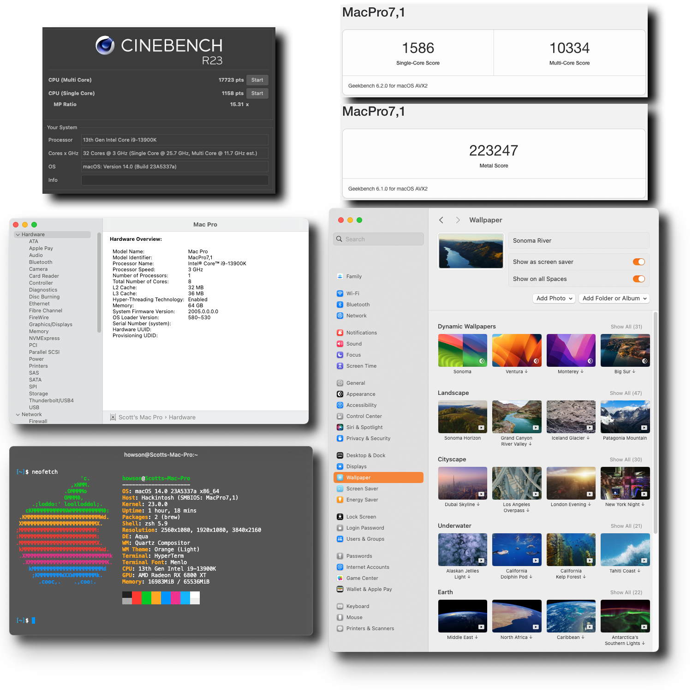
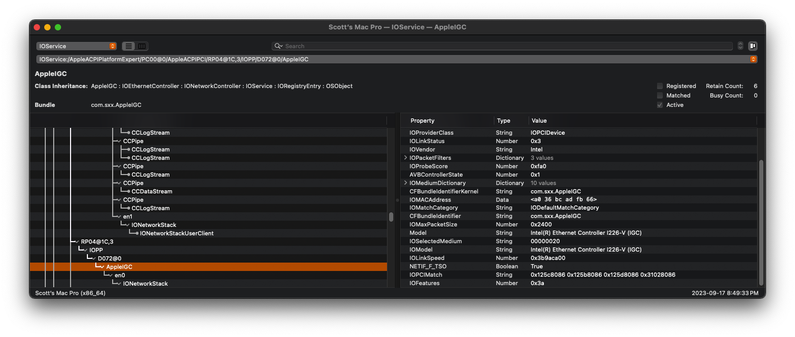

<div style="position: absolute;" align="center">

[](https://github.com/scotthowson/ROG-STRIX-Z790-A-GAMING-WIFI-Intel-i9-13900k-RX-6800-XT-OpenCore-1.0.2/releases/latest)
[](https://github.com/IllSaft/ROG-STRIX-Z790-A-GAMING-WIFI-Intel-i9-13900k-RX-6800-XT-OpenCore-0.9.4/issues)
[](https://github.com/scotthowson/ROG-STRIX-Z790-A-GAMING-WIFI-Intel-i9-13900k-RX-6800-XT-OpenCore-1.0.2/stargazers)
[](https://github.com/IllSaft/ROG-STRIX-Z790-A-GAMING-WIFI-Intel-i9-13900k-RX-6800-XT-OpenCore-0.9.4/releases/)
</div>

<div align="center">
  🚀 We're committed to ongoing improvements. With two updates already released, our guide is always evolving to ensure seamless compatibility with the latest macOS Sequoia and OpenCore versions. Stay tuned for even more refinements!
</div>

<div align="center">
  <h1>Sequoia is Here: Your Hackintosh EFI & Guide 🚀</h1>
  <p>Welcome to my Raptor Lake and 13th Gen Intel Hackintosh Repository!</p>
  <p>Whether you're a veteran or a newcomer, this guide provides carefully tested drivers and tools for optimal compatibility, stability, and performance. Count on this resource to help you maximize your Raptor Lake Hackintosh setup.</p>
  <p>Sequoia is all about innovation and performance. Get ready to experience the future of computing!</p>
  <p>🔥 #SequoiaIsHere 🔥</p>
</div>

<div align="center">
  <h1>🚀 Sequoia with OpenCore 1.0.2: Latest Updates 🚀</h1>
  <p>Sequoia is running flawlessly on my system with OpenCore 1.0.2. After two updates, the performance has reached new heights. Thanks to the Hackintosh community for their support! 🎉</p>
  <p>🔥 #Hackintosh #SequoiaSuccess 🔥</p>
</div>

<details>
  <summary><strong>macOS 15 Sequoia</strong></summary>
  <div align="center">

**macOS Sequoia**

<p>🔥 Sequoia delivers an unmatched Hackintosh experience! The dedication is well worth the result. 🔥</p>

**📷 Screenshots**

**About This Mac:**


**macOS Sequoia Benchmarks:**


<p>🚀 Sequoia brings a refined touch to my Hackintosh setup. 🚀</p>
  </div>
</details>

<details>
  <summary><strong>macOS 14 Sonoma</strong></summary>
  <div align="center">

**macOS Sonoma**

<p>🔥 Sonoma continues to offer an elegant Hackintosh experience! Well worth the effort. 🔥</p>

**📷 Screenshots**

**About This Mac:**


**macOS Sonoma Benchmarks:**


<p>🚀 Sonoma enhances my Hackintosh with a polished user experience. 🚀</p>
  </div>
</details>

<details>
  <summary><strong>macOS 13 Ventura</strong></summary>
  <div align="center">

**macOS Ventura**

<p>🔥 Ventura powers my Hackintosh with smooth performance and stability. 🔥</p>

**📷 Screenshots**

**About This Mac:**


<p>🚀 Ventura continues to bring excellent performance to my Hackintosh setup. 🚀</p>
  </div>
</details>

> [!IMPORTANT]  
> If you encounter any issues, please report them by opening an [issue here](https://github.com/scotthowson/ROG-STRIX-Z790-A-GAMING-WIFI-Intel-i9-13900k-RX-6800-XT-OpenCore-1.0.2/issues).

> [!WARNING]  
> I disclaim any responsibility or liability for damages that may arise from the use of information provided in this repository.

<details>
  <summary><strong>System Specifications 🛠️</strong></summary>

## Specifications 🛠️
<div align="center" style="width: 100%">
<table>
  <thead>
    <tr>
      <th>Hardware</th>
      <th align="center">Model</th>
      <th align="center">Status</th>
    </tr>
  </thead>
  <tbody>
    <tr>
      <td>Motherboard</td>
      <td align="center">Asus ROG Strix Z790-A Gaming Wi-Fi D4</td>
      <td align="center">✅</td>
    </tr>
    <tr>
      <td>CPU</td>
      <td align="center">13th Gen Intel® Core i9-13900k</td>
      <td align="center">✅</td>
    </tr>
    <tr>
      <td>GPU</td>
      <td align="center">AMD Radeon™ RX 6800 XT Phantom Gaming D (16 GB)</td>
      <td align="center">✅</td>
    </tr>
    <tr>
      <td>RAM</td>
      <td align="center">64GB Corsair Vengeance RGB Pro (2 x 32GB)</td>
      <td align="center">✅</td>
    </tr>
    <tr>
      <td>Ethernet</td>
      <td align="center">Intel® Ethernet Controller I226-V</td>
      <td align="center">✅</td>
    </tr>
    <tr>
      <td>Wi-Fi & Bluetooth</td>
      <td align="center">Intel® Wi-Fi 6E AX210</td>
      <td align="center">✅</td>
    </tr>
    <tr>
      <td>Case</td>
      <td align="center">HYTE Y60 Dual Chamber Tempered Glass Mid-Tower</td>
      <td align="center">✅</td>
    </tr>
    <tr>
      <td>Cooler</td>
      <td align="center">NZXT Kraken Elite 360mm AIO CPU Liquid Cooler</td>
      <td align="center">✅</td>
    </tr>
    <tr>
      <td colspan="3"><strong>Storage Devices</strong></td>
    </tr>
    <tr>
      <td>macOS Bootable NVMe M.2 (2TB)</td>
      <td align="center" colspan="2">WD_BLACK SN770 2TB</td>
    </tr>
    <tr>
      <td>macOS NVMe M.2 (1TB)</td>
      <td align="center" colspan="2">WD Blue SN570 1TB</td>
    </tr>
    <tr>
      <td>Windows Bootable NVMe M.2 (512GB)</td>
      <td align="center" colspan="2">INTEL SSDPEKNW512G8</td>
    </tr>
    <tr>
      <td>Windows NVMe M.2 (1TB)</td>
      <td align="center" colspan="2">WD Blue SN570 1TB</td>
    </tr>
    <tr>
      <td>Kingston SSD (960GB)</td>
      <td align="center" colspan="2">KINGSTON SA400S37960G</td>
    </tr>
    <tr>
      <td>Seagate HDD (2TB)</td>
      <td align="center" colspan="2">ST2000LX001-1RG174</td>
    </tr>
    <tr>
      <td>Seagate HDD (1TB)</td>
      <td align="center" colspan="2">ST1000DM003-1CH162</td>
    </tr>
  </tbody>
</table>
</div>
</details>

> [!NOTE]  
> These specifications are specific to my setup and may require customization for your system to perform optimally.

**Key Considerations 🤔**

- **Processor Compatibility:** The Intel Core i9-13900K is a powerful CPU, and with OpenCore 1.0.2, it’s crucial to ensure that all required kexts and configurations are up-to-date and fully compatible with this processor for optimal macOS Sequoia performance.

- **ASUS Z790-A Gaming WiFi D4:** This motherboard is a solid choice for Hackintosh builds, but it’s essential to verify that the correct kexts and configurations are applied to guarantee stability and full functionality with macOS Sequoia.

- **macOS Sequoia:** As Sequoia is the latest macOS release, staying on top of compatibility updates for your hardware is key. OpenCore 1.0.2 provides enhanced support, but some adjustments or updates may still be required to ensure a smooth experience.

**Best Practices 📝**

- **Kext Management:** Regularly check for updates to your kexts and confirm compatibility with macOS Sequoia, the i9-13900K, and the ASUS Z790-A motherboard. Always download kexts from trusted sources.

- **Configuration Backups:** Back up your OpenCore configuration frequently. This ensures you can quickly restore a stable state if anything goes wrong during updates or tweaks.

- **Community Involvement:** Use Hackintosh forums and communities to stay informed about compatibility, troubleshooting, and tips for running macOS Sequoia on your hardware. The collective knowledge can be invaluable.

- **Keep OpenCore Updated:** OpenCore 1.0.2 is highly optimized, but as new updates roll out, upgrading can bring performance improvements, bug fixes, and better compatibility with macOS Sequoia and future updates.

**Conclusion 🎉**

Using OpenCore 1.0.2 with macOS Sequoia on your Intel i9-13900K and ASUS Z790-A Gaming WiFi D4 motherboard offers a high-performance Hackintosh experience. Staying informed about hardware compatibility, keeping your kexts updated, and engaging with the Hackintosh community are crucial steps to ensure a stable and efficient system.

> [!IMPORTANT]  
> **Take advantage of the Hackintosh community. With regular maintenance and proper configurations, you can enjoy the full potential of macOS Sequoia on your unique hardware setup.**

## Hackintosh Community Resources 🌐

- **[r/hackintosh (Reddit)](https://www.reddit.com/r/hackintosh/):** A popular subreddit dedicated to Hackintosh discussions, troubleshooting, and community support.

- **[tonymacx86](https://www.tonymacx86.com/):** This website offers Hackintosh guides, tools, and a community forum where users share their experiences and solutions.

- **[InsanelyMac](https://www.insanelymac.com/):** A longstanding Hackintosh forum with a wealth of resources, guides, and a community of Hackintosh enthusiasts.

- **[OpenCore Bootloader](https://dortania.github.io/OpenCore-Install-Guide/):** The official OpenCore documentation is an essential resource for setting up and configuring your Hackintosh.

- **[Hackintosh.com](https://hackintosh.com/):** This site offers various Hackintosh guides, downloads, and a forum for discussions and support.

- **[OSx86 Project](https://www.osx86project.org/):** An older community that still provides useful information and resources for Hackintosh users.

- **GitHub:** Many Hackintosh projects and drivers can be found on GitHub. Search for specific hardware or software-related repositories to find the latest updates and contributions.

- **Hackintosh Discord Servers:** There are several Discord servers dedicated to Hackintosh enthusiasts. You can search for them on Discord or join the tonymacx86 Discord server, which often has active discussions.

> [!WARNING]
> Generate an SMBIOS: Ensure you generate a new SMBIOS to maintain system stability and compliance.

## Regenerating a New Serial with GenSMBIOS

If you need to regenerate a new serial number for your Hackintosh, you can use the GenSMBIOS tool. This is useful when you encounter issues related to duplicate serial numbers or want to ensure your system remains unique. Follow these steps:

1. **Download GenSMBIOS**: You can download GenSMBIOS from its official GitHub repository [here](https://github.com/corpnewt/GenSMBIOS).

2. **Extract the Tool**: After downloading, extract the GenSMBIOS tool to a convenient location on your system.

3. **Open Terminal**: Launch the Terminal application on your Hackintosh.

4. **Navigate to GenSMBIOS Directory**: Use the `cd` command in Terminal to navigate to the directory where you extracted GenSMBIOS. For example, if you extracted it to your Downloads folder, you would use the following command:
   
```
cd ~/Downloads/GenSMBIOS
```
1. Run GenSMBIOS: Execute the GenSMBIOS script with the following command:
```
./GenSMBIOS.command
```
2. Follow the Prompts: GenSMBIOS will guide you through the process of generating a new serial number. It will ask you for your system type, and you should select the appropriate option.

3. Generate Serial: Once you've made your selection, GenSMBIOS will generate a new serial number and display it on the screen. Make note of this serial number.

4. Update Your Config.plist: Open your Hackintosh's config.plist with a text editor and replace the existing serial number with the new one generated by GenSMBIOS.

5. Save and Reboot: Save the changes to your config.plist and reboot your Hackintosh.

6. Verify: After rebooting, use the "About This Mac" section to verify that the new serial number is now in use.

> [!IMPORTANT]
> **Why Generating a New SMBIOS is Important**
> Regenerating a new serial number with GenSMBIOS is a crucial step in your Hackintosh setup. Here's why it's important:
> - **Avoid Duplicate Serials:** Using a unique serial number ensures that your Hackintosh doesn't share the same serial as another Mac on Apple's servers. Duplicate serials can lead to various issues, including iMessage and iCloud not working.
> - **Maintain Privacy:** Using a serial number generated by GenSMBIOS helps protect your privacy. It's important not to use a serial number that belongs to a real Mac, as it can potentially lead to unintended consequences.
> - **Ensure Stability:** A new, unique serial number can contribute to the stability of your Hackintosh system. It reduces the chances of Apple's servers detecting irregularities and flagging your system.
> - **Compliance with EULA:** Apple's End User License Agreement (EULA) prohibits the installation of macOS on non-Apple hardware. While Hackintoshing is a popular and widely used practice, using a unique serial number helps you stay within the bounds of legality.
> Generating a new serial number with GenSMBIOS helps you maintain the functionality and stability of your Hackintosh while ensuring your compliance with Apple's EULA.

## Kexts 🧩

> [!IMPORTANT]
> Essential kexts crucial for your success.

1. **Lilu Kext** [^1]
   - [Download Lilu](https://github.com/acidanthera/Lilu/releases)

2. **VirtualSMC Kexts** [^2]
   - [Download VirtualSMC](https://github.com/acidanthera/VirtualSMC/releases)

3. **WhateverGreen** [^3]
   - [Download WhateverGreen](https://github.com/acidanthera/WhateverGreen/releases)

4. **AppleALC** [^4]
   - [Download AppleALC](https://github.com/acidanthera/AppleALC/releases)

5. **Airportitlwm** [^5]
   - [Download Airportitlwm](https://github.com/OpenIntelWireless/itlwm/releases)

6. **AppleIGC** [^6]
   - [Download AppleIGC](https://github.com/SongXiaoXi/AppleIGC/releases)

> [!IMPORTANT]
> Non-essential kexts that, while optional, can enhance system stability.

7. **CPUFriend Kext** [^7]
   - [Download CPUFriend](https://github.com/acidanthera/CPUFriend/releases)

8. **CpuTopologyRebuild** [^8]
   - [Download CpuTopologyRebuild](https://github.com/b00t0x/CpuTopologyRebuild/releases)

> [!NOTE]
> For optimal results following any configuration edits, it is recommended to perform an NVRAM reset.  [^9]

> [!NOTE]
> The following is my kext configuration order. It's essential to use kexts tailored to your hardware and macOS version. Keep them updated and maintain a backup of your working configuration to ensure system stability.


## Enabling Intel I225-V Ethernet

**To enable the Intel I225-V Ethernet Controller and ensure compatibility with 3rd-party WiFi/LAN cards, follow this guide:**

- [**Enabling the Intel I225-V Ethernet Controller**](https://github.com/5T33Z0/Gigabyte-Z490-Vision-G-Hackintosh-OpenCore/blob/main/I225_stock_vs_cstmfw.md)

  - *Credits:* [5T33Z0](https://github.com/5T33Z0)



## BIOS Settings 📟

**Bios Information:**
  - Bios version: **1303**
    - Updating this BIOS will simultaneously update the corresponding **Intel ME to version 16.1.27.2176**.

**Disable:**
  -  Boot > Boot > CSM (Compatibility Support Module) > Launch CSM > Disabled
  -  Boot > Secure Boot > OS Type > Other OS
  -  Boot > Secure Boot > Secure Boot Mode > Custom
  -  Boot Configuration > Fast Boot > Disabled

**Enable:**
  -  Advanced > Active Performance Cores > All
  -  Advanced > Efficient Cores > All
  -  Advanced > Hyper-Threading > Enabled
  -  Advanced > System Agent (SA) Configuration > VT-D > Enabled
  -  Advanced > System Agent (SA) Configuration > Memory Configuration > Memory Remap > Enabled
  -  Advanced > System Agent (SA) Configuration > Graphics Configuration > Primary Display > PCIe
  -  Advanced > System Agent (SA) Configuration > Graphics Configuration > iGPU Multi-Monitor > Disabled
  -  Advanced > Trusted Computing > Security Device Support > Enabled
  -  Advanced > PCI Subsystem Settings > Above 4G Decoding > Enabled
  -  Advanced > PCI Subsystem Settings > Resize BAR Support > Enabled
  -  Advanced > USB Configuration > Legacy USB Support > Enabled
  -  Advanced > USB Configuration > XHCI Hand-off > Enabled
  -  Ai Tweaker > Ai Overclock Tuner > XMP II
  -  Ai Overclock > Auto

## Enabling FileVault on Your Hackintosh 🔐

FileVault is a security feature in macOS that encrypts the contents of your disk, adding an extra layer of protection to your data. Enabling FileVault on your Hackintosh is possible, but it requires some additional considerations and configurations. Here's a step-by-step guide to help you set up FileVault:

1. **Ensure Stable Hackintosh Setup**: Before proceeding, make sure your Hackintosh is stable and all hardware components are working correctly. FileVault can be sensitive to system changes, so a stable setup is essential.

2. **Backup Your Data**: It's crucial to back up all your data before enabling FileVault. In rare cases, issues during the encryption process can lead to data loss.

3. **Generate a New SMBIOS**: FileVault is tied to your system's unique identifier. If you haven't already, generate a new SMBIOS (System Management BIOS) to mimic a real Mac. This helps in ensuring compatibility.

4. **Enable FileVault**:
   - Go to **System Preferences** > **Security & Privacy** > **FileVault**.
   - Click the lock icon and enter your administrator password.
   - Click the "Turn On FileVault" button.
   - You'll be asked to create a recovery key. Make sure to save it in a secure place; it can be crucial for data recovery in case you forget your password.

5. **Encryption Process**: Your Hackintosh will start the encryption process, which may take a while depending on the size of your disk. During this time, you can continue to use your computer, but it might be slower than usual.

6. **Reboot and Test**: After the encryption is complete, reboot your Hackintosh and test whether FileVault works as expected. You should be prompted to enter your password or use your recovery key to unlock your disk at boot.

7. **Backup Your Recovery Key**: Keep your recovery key safe. If you lose it, you might lose access to your data. You can also store it securely with Apple if you have an Apple ID.

8. **Ongoing Use**: FileVault should now be enabled and protecting your data. Continue to use your Hackintosh as usual, and FileVault will automatically encrypt and decrypt your files in the background.

Please note that while enabling FileVault adds an extra layer of security, it may also introduce some complexities and potential issues. Make sure to have a good understanding of Hackintoshing and macOS security before enabling FileVault. Always keep your system and data backed up, and proceed with caution.

## Understanding OpenCore Vault for Added Security

The OpenCore Vault is a security feature designed to enhance the protection of your Hackintosh system's EFI configuration. It consists of two key components: `vault.plist` and `vault.sig`:

- **vault.plist**: This file acts as a "snapshot" of your EFI configuration.
- **vault.sig**: It's a validation file that verifies the integrity of `vault.plist`.

Think of the OpenCore Vault as a secure boot mechanism for OpenCore, ensuring that no unauthorized modifications can be made to your EFI configuration without your permission.

### How Vaulting Works🔐

The specifics of vaulting involve the creation of a 256-byte RSA-2048 signature of the `vault.plist`. This signature is then incorporated into your `OpenCore.efi` bootloader. You can insert this key either into `OpenCoreVault.c` before compiling or use the `sign.command` tool if you already have `OpenCore.efi` compiled.

Please note that `nvram.plist` won't be vaulted. Therefore, users with emulated NVRAM may still face risks related to unauthorized changes to specific NVRAM variables.

### Configuring Vault in Your `config.plist`

To set up the OpenCore Vault, you need to configure it in your `config.plist`. Here's how:

- **Misc -> Security -> Vault**:
    - - **Basic**: Requires only `vault.plist` to be present, mainly used for filesystem integrity verification.
    - - **Secure**: Requires both `vault.plist` and `vault.sig`, providing the highest level of security as changes to `vault.plist` necessitate a new signature.
- **Booter -> ProtectSecureBoot**: Set this option to `YES`.
    - - This setting is essential, especially for systems with Insyde firmware, as it helps fix secure boot keys and reports violations.

### Setting Up the OpenCore Vault

To set up the OpenCore Vault, you'll need to access the OpenCorePkg repository and navigate to the `CreateVault` folder. Inside this folder, you'll find several files, but the one we're interested in is `sign.command`.

Here's how to configure your OpenCore Vault:

1. Run the `sign.command` script.
2. It will search for the EFI folder located next to the `Utilities` folder. Ensure that you have either placed your personal EFI configuration inside the OpenCorePkg folder or moved the `Utilities` folder into your EFI directory.

By following these steps, you enable the OpenCore Vault feature, adding an extra layer of security to your Hackintosh system, safeguarding your EFI configuration from unauthorized modifications.

  - *Credits:* [Dortania | Vault](https://dortania.github.io/OpenCore-Post-Install/universal/security/vault.html)

> [!IMPORTANT]
> Ensure that your 'config.plist' file is entirely in lowercase, as sign.command won't recognize the file otherwise.

## Hackintosh Checklist ✅ - What's Working?

> [!NOTE]
> If anything doesn't work for you, report the issue [here](https://github.com/IllSaft/ROG-STRIX-Z790-A-GAMING-WIFI-Intel-i9-13900k-RX-6800-XT-OpenCore-0.9.4/issues).

1. **OpenCore Booting**
    - [x] Correct OS choices shown in OpenCore Menu/GUI
    - [ ] Keyboard shortcuts working (see details below)
        - CMD+V — verbose mode.
    - [x] NVRAM working (Verifying if you have working NVRAM)
        - Apple -> System Preferences -> Startup Disk (uses NVRAM).
    - [x] Security (especially SIP) use Menu Bar SIP Detector
    - [x] FileVault
    - [x] Multibooting

2. **Display**
    - [x] Display via HDMI
    - [x] Display via HDMI
    - [x] Display via DisplayPort
    - [x] Display via DVI
    - [x] Resolution
    - [x] Refresh rates
    - [x] Multimonitor displays

3. **Graphics Acceleration**
    - [x] dGPU dedicated GPU
        - In Terminal: gfxutil -f GFX0 or check in IORegistryExplorer
    - [x] QE/CI (full acceleration requires both Quartz Extreme and Core Image)
        - Check for transparent menu bar and fast smooth UI.
    - [x] VDA (Video Decode Acceleration framework)
        - Hackintool -> System -> System -> VDA Decoder (should show 'fully supported')
    - [x] Metal
        - System Information -> Graphics/Displays -> Metal: Supported
        - GLView
        - Geekbench -> Compute -> Metal

4. **Audio**
    - [x] Audio out (Audio MIDI Setup)
    - [x] Audio in
    - [x] Front panel audio connectors
    - [x] Audio over HDMI
    - [x] Audio quality

5. **Sleep & Power**
    - [x] Manual Sleep (Apple menu -> Sleep)
    - [x] Auto Sleep (System preferences -> Energy Saver)
    - [x] Wake by keyboard
    - [x] Wake by mouse/trackpad
    - [x] Sleep by Press and hold power button for 1.5 seconds
    - [x] Shutdown (from Apple menu)
    - [x] Restart (from Apple menu)

6. **CPU**
    - [x] CPU Power Management (Optimizing Power Management)
        - Check with IORegistryExplorer
    - [ ] Temperatures and stability with 100% CPU
        - Use Prime95 Torture Test

7. **Disk**
    - Test with Blackmagic Disk Speedtest
    - [x] NVMe SSD
        - Write: 878.3 MB/s
        - Read: 1388.5 MB/s
    - [x] SATA SSD
        - Write: 103.4 MB/s
        - Read: 454.1 MB/s
    - [x] TRIM support (System Information -> SATA -> SSD drive)

> [!NOTE]
> Quick Tip: Enabling TRIM support on your Hackintosh:
> To enable trim support, simply open up a Terminal and type in the following command: `sudo trimforce enable`

8. **Keyboard**
    - [x] Option/Command correctly mapped in macOS
        - For PC Keyboards swap in: System preferences -> Keyboard -> Modifier Keys
    - [x] Fn keys working

9. **USB**
    - Use USBMap
    - Test external drives with Blackmagic Disk Speedtest
    - [x] USB 2 ports
    - [x] USB 2 on USB 3 ports
    - [x] USB 3 and 3.1 ports (check transfer speed during copy)
    - [x] USB C ports
    - [x] Camera (Photo Booth, Facetime, Zoom)

10. **Ethernet**
    - [x] Gigabit LAN (System preferences -> Network -> Ethernet -> Advanced -> Hardware -> Speed should be 1000baseT)

11. **Wi-Fi & Bluetooth**
    - [x] Wi-Fi transmission speed (Option Click -> Wifi menu bar icon -> check Tx Rate)
    - [x] Bluetooth devices (trackpad, mouse, keyboard, headset)
    - [ ] AirDrop (test with iDevices)
    - [ ] AirPlay to Mac (macOS Monterey or later, test with iOS 14 or later devices)
        - Tap the AirPlay icon on your Apple device to share videos to your Hackintosh
    - [ ] Handoff (System requirements for Continuity and Use Continuity which requires macOS Catalina & iOS 13+)
    - [ ] Sidecar requires macOS Catalina or later and a compatible iPad using iPadOS 13 or later.

> [!IMPORTANT]
> Having issues with AirDrop. Working on a solution. :tada:

12. **OS Features**
    - [x] iMessage, FaceTime, App Store, iTunes Store
    - [x] DRM support (iTunes Movies, Apple TV+, Amazon Prime, Netflix, and others)

## Troubleshooting 🛠️

Encountering issues with your Hackintosh setup? Don't worry; many users face challenges during the installation and configuration process. This Troubleshooting section aims to provide solutions to common problems. Before diving into the troubleshooting steps, please ensure that you have backed up your data and configurations.

### General Troubleshooting Tips

Before addressing specific issues, consider the following general troubleshooting tips:

- **Check Your EFI Configuration:** Ensure your EFI folder contains the necessary kexts, ACPI patches, and configuration files. Verify that you've followed the guide's recommendations for your hardware.

- **Check Hardware Compatibility:** Confirm that your hardware components (CPU, motherboard, GPU, etc.) are compatible with macOS and your chosen OpenCore version.

- **Update OpenCore:** Make sure you're using the latest version of OpenCore. Sometimes, updating to a newer release can resolve compatibility issues.

- **Check for Errors:** Keep an eye out for error messages during the boot process. These can provide valuable clues about what's wrong.

### Common Issues and Solutions

Here are some common issues users face when setting up a Hackintosh and their potential solutions:

#### **1. Booting Fails or Stuck at Apple Logo**

- **Issue:** Your system doesn't boot, or it gets stuck at the Apple logo.

- **Solution:**
  - Check your EFI configuration for errors, including kexts and ACPI patches.
  - Verify that your config.plist settings match your hardware and chosen OpenCore version.
  - Consider booting in verbose mode (`-v`) to identify where the boot process fails.

#### **2. Graphics Glitches or Poor Performance**

- **Issue:** You experience graphical glitches, poor performance, or your GPU isn't recognized correctly.

- **Solution:**
  - Ensure that you've correctly injected your GPU in your config.plist.
  - Update your GPU drivers (WhateverGreen, Lilu) to the latest versions.
  - Check for any conflicts between kexts or ACPI patches related to graphics.

#### **3. Audio and Networking Problems**

- **Issue:** Your audio isn't working, or you have issues with network connectivity.

- **Solution:**
  - Verify that you're using the appropriate audio and networking kexts for your hardware.
  - Check for conflicting kexts that might interfere with audio or network functionality.

#### **4. Sleep/Wake Issues**

- **Issue:** Your Hackintosh doesn't go to sleep, or it has trouble waking up from sleep.

- **Solution:**
  - Review your config.plist settings related to power management and sleep.
  - Ensure that your SSDT for power management is correctly patched for your hardware.

#### **5. Kernel Panics or System Crashes**

- **Issue:** Your system frequently experiences kernel panics or crashes.

- **Solution:**
  - Check your EFI configuration for unstable or outdated kexts.
  - Review your ACPI patches for any potential conflicts.
  - Monitor system logs (Console) for error messages that can help identify the cause.

#### **6. USB Port Issues**

- **Issue:** You have problems with USB ports, such as devices not recognized or intermittent disconnects.

- **Solution:**
  - Create a USB map to ensure proper USB port configuration.
  - Check for USB-related issues in your config.plist.

#### **7. Bluetooth and Wi-Fi Problems**

- **Issue:** Your Bluetooth or Wi-Fi isn't working as expected.

- **Solution:**
  - Ensure that you're using compatible Bluetooth and Wi-Fi kexts for your hardware.
  - Verify that your hardware is supported by macOS.

### 💬 Get Help & Report Issues

If you encounter issues that aren't covered here or need personalized assistance, consider reaching out to the Hackintosh community forums, Discord servers, or GitHub repositories mentioned in the ["Hackintosh Community Resources"](#Hackintosh-Community-Resources) section. Remember to provide detailed information about your hardware, configuration, and the specific issue you're facing for more accurate troubleshooting help.

> [!WARNING]
> Proceed with caution when applying fixes or modifications. Always back up your data and configurations before making changes to your EFI or system files.

---

> [!WARNING]
> **Important Disclaimer:** 🚧<br>
>This repository is intended for educational and experimental purposes only. Using macOS on non-Apple hardware, also known as Hackintosh, may violate Apple's End User License Agreement (EULA). The process involves potential risks, including but not limited to data loss or instability. By using the information and resources provided here, you agree that you are solely responsible for any consequences that may arise. Always ensure you have proper backups and proceed at your own risk.

<details>
  <summary><strong>USB Preparation</strong></summary>

# USB Preparation for OpenCore Installation

This guide outlines the steps to prepare a USB drive for OpenCore installation using the terminal.

### Steps:

1. **Determine USB Device Block:**
    ```bash
    lsblk
    ```
    Identify your USB device block from the output.

2. **Run `gdisk` on the USB Block:**
    ```bash
    sudo gdisk /dev/<your USB block>
    ```
    - If prompted for a partition table, select GPT.
    - Use `p` to print the block's partitions and verify the correct device.
    - Use `o` to clear the partition table and create a new GPT table (confirm with `y`).

3. **Create Partitions:**
    - Create the first partition:
        ```bash
        n
        ```
        - Partition number: Keep blank for default
        - First sector: Keep blank for default
        - Last sector: `+200M` (to create a 200MB partition)
        - Hex code or GUID: `0700` (Microsoft basic data partition type)

    - Create the second partition:
        ```bash
        n
        ```
        - Partition number: Keep blank for default
        - First sector: Keep blank for default
        - Last sector: Keep blank for default (or `+3G` to partition the rest of the USB)
        - Hex code or GUID: `af00` (Apple HFS/HFS+ partition type)

4. **Write Changes and Quit:**
    ```bash
    w
    ```
    Confirm with `y`.

5. **Optional: Reboot or Re-plug USB:**
    In some cases, a reboot might be needed, but rarely. Re-plugging the USB key can also suffice.

6. **Determine Partition Blocks:**
    ```bash
    lsblk
    ```
    Identify the 200MB drive and the other partition.

7. **Format the 200MB Partition to FAT32:**
    ```bash
    sudo mkfs.vfat -F 32 -n "OPENCORE" /dev/<your 200MB partition block>
    ```

8. **Prepare macOS Recovery Files:**
    - Change directory to macrecovery utilities:
        ```bash
        cd /OpenCore/Utilities/macrecovery/
        ```
    - Mount the USB partition:
        ```bash
        udisksctl mount -b /dev/<your 200MB partition block> # No sudo required in most cases
        # or
        sudo mount /dev/<your 200MB partition block> /where/your/mount/stuff # sudo required
        ```
    - Create necessary directories on USB:
        ```bash
        cd /path/to/your/mounted/USB
        mkdir com.apple.recovery.boot
        ```

9. **Download and Use `dmg2img`:**
    - Install `dmg2img` (available on most distros):
        ```bash
        sudo apt-get install dmg2img # For Debian-based distros
        sudo yum install dmg2img # For RHEL-based distros
        ```
    - Determine partition with disk image property:
        ```bash
        dmg2img -l BaseSystem.dmg
        ```
    - Extract and write recovery image:
        ```bash
        sudo dmg2img -p <the partition number> BaseSystem.dmg /dev/<your 3GB+ partition block>
        ```

### Notes:
- The extraction process can take several minutes, especially on slower USB drives.
- Ensure to replace placeholders (`<your USB block>`, `<your 200MB partition block>`, etc.) with actual values from your setup.

Follow these steps carefully to prepare your USB drive for OpenCore installation.

</details>

**Special Thanks 🙌**

I would like to express our gratitude to the Hackintosh community, contributors, and developers who have made this repository possible. Your dedication, support, and shared knowledge have been invaluable in creating a thriving ecosystem for macOS enthusiasts. Together, we continue to explore new horizons and push the boundaries of what's achievable with Hackintosh.

Thank you for being a part of this journey!

<h6>Footnotes:</h6>

[^1]: An open source kernel extension bringing a platform for arbitrary kext, library, and program patching throughout the system for macOS.
[^2]: Advanced Apple SMC emulator in the kernel. Requires Lilu for full functioning.
[^3]: A Lilu plugin providing patches to select GPUs on macOS. Requires Lilu 1.5.6 or newer.
[^4]: An open source kernel extension enabling native macOS HD audio for not officially supported codecs without any filesystem modifications. AppleALCU can be used for systems with digital-only audio.
[^5]: An Intel Wi-Fi Adapter Kernel Extension for macOS, based on the OpenBSD Project.
[^6]: Intel 2.5G Ethernet driver for macOS. Based on the Intel igc implementation in Linux commit 0bf913e07b377cfc288cfe488ca30b7d67059d8a.
[^7]: A Lilu plug-in for dynamic power management data injection.
[^8]: An experimental Lilu plugin that optimizes Alder Lake / Raptor Lake's heterogeneous core configuration.
[^9]: When the HideAuxiliary option is Enabled, you need to press the Space Bar Key on your Keyboard to show all the other options in the picker.
