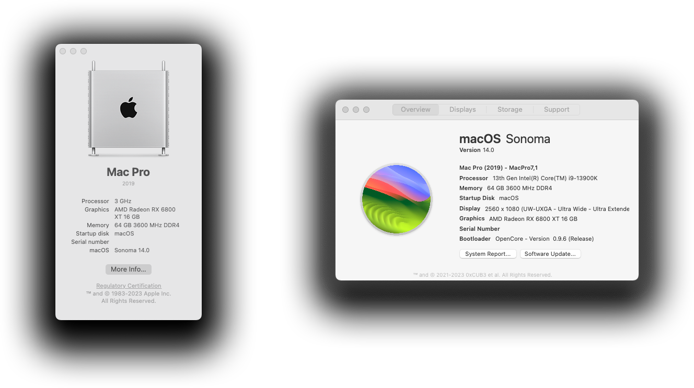
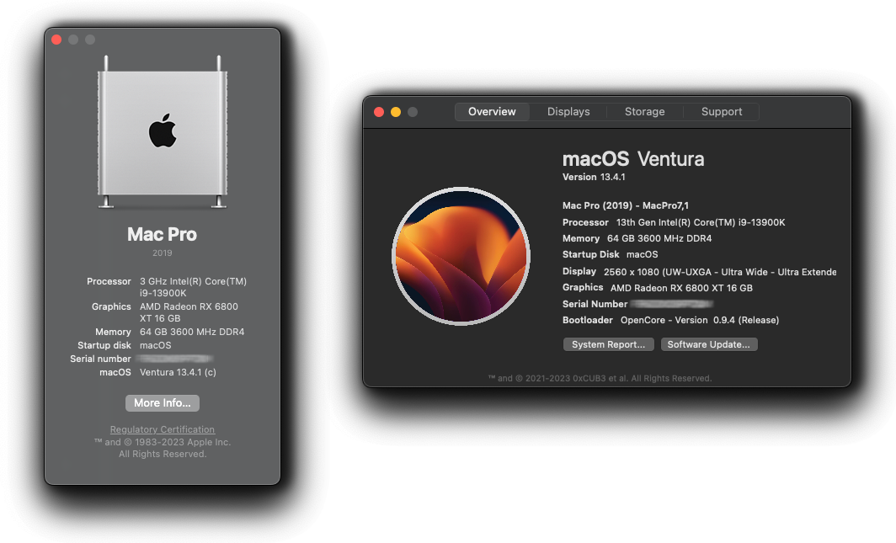
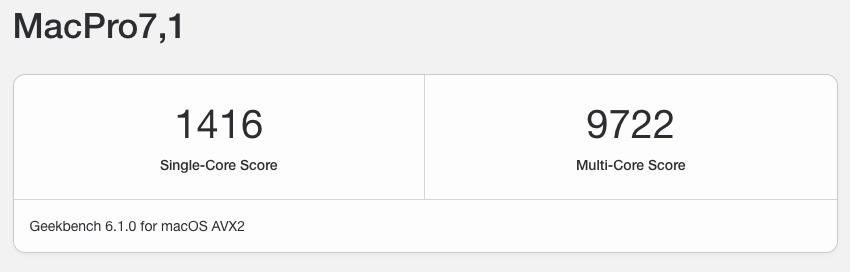
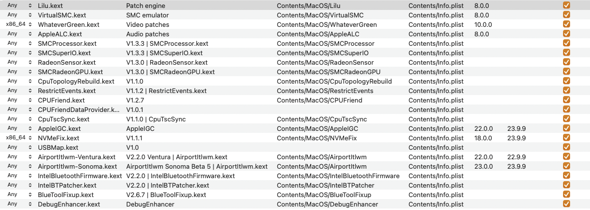

<div align="center">
  <h1>A Hackintosh EFI & Guide for macOS Ventura & Sonoma: Unveiling Soon! 🚀</h1>
  <p>Welcome to my Raptor Lake and 13th Gen Intel Hackintosh Repository!</p>
  <p>Whether you're a seasoned Hackintosh enthusiast or a curious newcomer, this repository offers a meticulously curated guide, drivers, and tools, all rigorously tested and fine-tuned for seamless compatibility, stability, and peak performance. Trust me as your go-to source for maximizing your Raptor Lake-based Hackintosh system's potential!</p>
  <p>Stay tuned for an exciting revelation that will transform your computing experience. Sonoma is on the horizon, and it's bringing innovation, power, and style like never before.</p>
  <p>Prepare to be amazed! 🔥 #SonomaIsComing</p>
</div>

<div align="center">
<h1>🚀 Success Story: Sonoma with OpenCore 0.9.6 🚀</h1>

<p>I'm thrilled to share that I've successfully set up Sonoma on my system using OpenCore 0.9.6! With meticulous configuration and the latest updates, my Hackintosh is now running smoothly with Sonoma's innovative features. It's a testament to the incredible Hackintosh community's dedication and support. Here's to pushing the boundaries of what's possible with macOS! 🎉 </p><p>#Hackintosh #SonomaSuccess"</p>
</div>
**macOS Sonoma:**

**macOS Ventura:**


## Screenshots:

**About This Mac:**

**macOS Sonoma:**

**macOS Ventura:**


**Geekbench 6 Results:**

**CPU Scores:**
- **13th Gen Intel® Core i9-13900k**


**GPU Scores:**
- **ASRock AMD Radeon RX 6800 XT**
  - Highest GPU Score: **223247**


> [!WARNING]
> I hereby disclaim any responsibility and liability for any damages that may arise from the use of information provided within this repository.

## Specifications
<div align="center" style="width: 100%">
<table>
  <thead>
    <tr>
      <th>Hardware</th>
      <th align="center">Model</th>
      <th align="center">Status</th>
    </tr>
  </thead>
  <tbody>
    <tr>
      <td>Motherboard</td>
      <td align="center">ASUS ROG STRIX Z790-A GAMING WIFI D4</td>
      <td align="center">❓</td>
    </tr>
    <tr>
      <td>CPU</td>
      <td align="center">13th Gen Intel® Core i9-13900k</td>
      <td align="center">✅</td>
    </tr>
    <tr>
      <td>RAM</td>
      <td align="center">64GB Corsair Vengeance RGB Pro 32GB (4 x 16GB)</td>
      <td align="center">✅</td>
    </tr>
    <tr>
      <td>GPU</td>
      <td align="center">AMD Radeon™ RX 6800 XT Phantom Gaming D (16 GB)</td>
      <td align="center">✅</td>
    </tr>
    <tr>
      <td>Storage</td>
      <td align="center">Intel SSDPEKNW512GB NVME</td>
      <td align="center">✅</td>
    </tr>
    <tr>
      <td>Ethernet</td>
      <td align="center">Intel® Ethernet Controller I226-V</td>
      <td align="center">✅</td>
    </tr>
    <tr>
      <td>Wi-Fi</td>
      <td align="center">Intel® Wi-Fi 6E AX211</td>
      <td align="center">✅</td>
    </tr>
  </tbody>
</table>
</div>

> [!NOTE]
> These specifications are tailored to my unique setup and may not be universally applicable. Your system may require adjustments and customization for optimal performance.

**Key Considerations:**

- **Processor Compatibility:** The Intel Core i9-13900K is a powerful CPU, and while OpenCore 0.9.4 provides a versatile platform for macOS, it's essential to ensure that all required kexts and configurations are up-to-date and compatible with this CPU model for optimal performance.

- **ASUS Z790-A Gaming WiFi D4:** This motherboard choice is versatile for Hackintosh setups, but it's crucial to research and select compatible kexts and configurations tailored to this specific motherboard model to ensure stability and functionality.

- **macOS Ventura:** As macOS Ventura is a relatively new release, staying informed about updates and compatibility with your hardware is vital. OpenCore 0.9.4 may require adjustments and updates to accommodate the latest macOS version.

**Best Practices:**

- **Kext Management:** Keep an eye on kext updates and ensure you're using versions compatible with macOS Ventura, i9-13900K, and your ASUS motherboard. Always download kexts from reputable sources.

- **Configuration Backups:** Regularly back up your OpenCore configuration files to avoid data loss in case of unexpected issues. This practice allows you to revert to a stable configuration if needed.

- **Community Support:** Leverage online forums and communities dedicated to Hackintosh setups, as they can provide valuable insights, troubleshooting tips, and updates regarding macOS Ventura compatibility.

- **Update OpenCore:** As new versions of OpenCore are released, consider updating to take advantage of improved features, bug fixes, and better compatibility with the latest macOS updates.

**Conclusion:**

Utilizing OpenCore 0.9.4 with macOS Ventura on your i9-13900K and ASUS Z790-A Gaming WiFi D4 setup can deliver a high-performance Hackintosh experience. However, staying informed about hardware compatibility, keeping your kexts and configurations up-to-date, and seeking community support when needed are essential steps to ensure a stable and smooth-running system.

> [!IMPORTANT]
> <b>Remember that the Hackintosh community is a valuable resource, and with proper research and maintenance, you can enjoy the benefits of macOS Ventura on your unique hardware configuration.</b>

## Hackintosh Community Resources

- **[r/hackintosh (Reddit)](https://www.reddit.com/r/hackintosh/):** A popular subreddit dedicated to Hackintosh discussions, troubleshooting, and community support.

- **[tonymacx86](https://www.tonymacx86.com/):** This website offers Hackintosh guides, tools, and a community forum where users share their experiences and solutions.

- **[InsanelyMac](https://www.insanelymac.com/):** A longstanding Hackintosh forum with a wealth of resources, guides, and a community of Hackintosh enthusiasts.

- **[OpenCore Bootloader](https://dortania.github.io/OpenCore-Install-Guide/):** The official OpenCore documentation is an essential resource for setting up and configuring your Hackintosh.

- **[Hackintosh.com](https://hackintosh.com/):** This site offers various Hackintosh guides, downloads, and a forum for discussions and support.

- **[OSx86 Project](https://www.osx86project.org/):** An older community that still provides useful information and resources for Hackintosh users.

- **GitHub:** Many Hackintosh projects and drivers can be found on GitHub. Search for specific hardware or software-related repositories to find the latest updates and contributions.

- **Hackintosh Discord Servers:** There are several Discord servers dedicated to Hackintosh enthusiasts. You can search for them on Discord or join the tonymacx86 Discord server, which often has active discussions.

> [!WARNING]
> Generate an SMBIOS: Ensure you generate a new SMBIOS to maintain system stability and compliance.

## Regenerating a New Serial with GenSMBIOS

If you need to regenerate a new serial number for your Hackintosh, you can use the GenSMBIOS tool. This is useful when you encounter issues related to duplicate serial numbers or want to ensure your system remains unique. Follow these steps:

1. **Download GenSMBIOS**: You can download GenSMBIOS from its official GitHub repository [here](https://github.com/corpnewt/GenSMBIOS).

2. **Extract the Tool**: After downloading, extract the GenSMBIOS tool to a convenient location on your system.

3. **Open Terminal**: Launch the Terminal application on your Hackintosh.

4. **Navigate to GenSMBIOS Directory**: Use the `cd` command in Terminal to navigate to the directory where you extracted GenSMBIOS. For example, if you extracted it to your Downloads folder, you would use the following command:
   
```
cd ~/Downloads/GenSMBIOS
```
1. Run GenSMBIOS: Execute the GenSMBIOS script with the following command:
```
./GenSMBIOS.command
```
2. Follow the Prompts: GenSMBIOS will guide you through the process of generating a new serial number. It will ask you for your system type, and you should select the appropriate option.

3. Generate Serial: Once you've made your selection, GenSMBIOS will generate a new serial number and display it on the screen. Make note of this serial number.

4. Update Your Config.plist: Open your Hackintosh's config.plist with a text editor and replace the existing serial number with the new one generated by GenSMBIOS.

5. Save and Reboot: Save the changes to your config.plist and reboot your Hackintosh.

6. Verify: After rebooting, use the "About This Mac" section to verify that the new serial number is now in use.

> [!IMPORTANT]
> **Why Generating a New SMBIOS is Important**
> Regenerating a new serial number with GenSMBIOS is a crucial step in your Hackintosh setup. Here's why it's important:
> - **Avoid Duplicate Serials:** Using a unique serial number ensures that your Hackintosh doesn't share the same serial as another Mac on Apple's servers. Duplicate serials can lead to various issues, including iMessage and iCloud not working.
> - **Maintain Privacy:** Using a serial number generated by GenSMBIOS helps protect your privacy. It's important not to use a serial number that belongs to a real Mac, as it can potentially lead to unintended consequences.
> - **Ensure Stability:** A new, unique serial number can contribute to the stability of your Hackintosh system. It reduces the chances of Apple's servers detecting irregularities and flagging your system.
> - **Compliance with EULA:** Apple's End User License Agreement (EULA) prohibits the installation of macOS on non-Apple hardware. While Hackintoshing is a popular and widely used practice, using a unique serial number helps you stay within the bounds of legality.
> Generating a new serial number with GenSMBIOS helps you maintain the functionality and stability of your Hackintosh while ensuring your compliance with Apple's EULA.


## Kexts

> [!IMPORTANT]
> Essential kexts crucial for your success.

1. **Lilu Kext** [^1]
   - [Download Lilu](https://github.com/acidanthera/Lilu/releases)

2. **VirtualSMC Kexts** [^2]
   - [Download VirtualSMC](https://github.com/acidanthera/VirtualSMC/releases)

3. **WhateverGreen** [^3]
   - [Download WhateverGreen](https://github.com/acidanthera/WhateverGreen/releases)

4. **AppleALC** [^4]
   - [Download AppleALC](https://github.com/acidanthera/AppleALC/releases)

5. **Airportitlwm** [^5]
   - [Download Airportitlwm](https://github.com/OpenIntelWireless/itlwm/releases)

6. **AppleIGC** [^6]
   - [Download AppleIGC](https://github.com/SongXiaoXi/AppleIGC/releases)

> [!IMPORTANT]
> Non-essential kexts that, while optional, can enhance system stability.

7. **CPUFriend Kext** [^7]
   - [Download CPUFriend](https://github.com/acidanthera/CPUFriend/releases)

8. **CpuTopologyRebuild** [^8]
   - [Download CpuTopologyRebuild](https://github.com/b00t0x/CpuTopologyRebuild/releases)

> [!NOTE]
> For optimal results following any configuration edits, it is recommended to perform an NVRAM reset.  [^9]

> [!NOTE]
> The following is my kext configuration order. It's essential to use kexts tailored to your hardware and macOS version. Keep them updated and maintain a backup of your working configuration to ensure system stability.



## Enabling Intel I225-V Ethernet

**To enable the Intel I225-V Ethernet Controller and ensure compatibility with 3rd-party WiFi/LAN cards, follow this guide:**

- [**Enabling the Intel I225-V Ethernet Controller**](https://github.com/5T33Z0/Gigabyte-Z490-Vision-G-Hackintosh-OpenCore/blob/main/I225_stock_vs_cstmfw.md)

  - *Credits:* [5T33Z0](https://github.com/5T33Z0)

## BIOS

**Disable:**

- Fast Boot
- Secure Boot
- Serial/COM Port
- Parallel Port
- VT-d (can be enabled if you set DisableIoMapper to YES)
- Compatibility Support Module (CSM)
- Thunderbolt (For initial install, as Thunderbolt can cause issues if not set up correctly)
- Intel SGX
- Intel Platform Trust
- CFG Lock (MSR 0xE2 write protection)
  - This must be off. If you can't find the option, then ENABLE AppleXcpmCfgLock. Your hack will not boot with CFG-Lock enabled.

**Enable:**

- VT-x
- Above 4G decoding
  - This must be on. If you can't find the option, then add npci=0x2000 to boot-args. Do not have both this option and npci on boot-args enabled at the same time. When enabling Above4G, Resizable BAR Support may become available on some motherboards. Please ensure this is DISABLED instead of set to Auto.
- Hyper-Threading
- Execute Disable Bit
- EHCI/XHCI Hand-off
- OS type: Windows 8.1/10 UEFI Mode
- SATA Mode: AHCI

## Hackintosh Checklist - What's Working?

> [!NOTE]
> If anything doesn't work for you, report the issue [here](https://github.com/IllSaft/ROG-STRIX-Z790-A-GAMING-WIFI-Intel-i9-13900k-RX-6800-XT-OpenCore-0.9.4/issues).

1. **OpenCore Booting**
    - [x] Correct OS choices shown in OpenCore Menu/GUI
    - [ ] Keyboard shortcuts working (see details below)
        - CMD+V — verbose mode.
    - [x] NVRAM working (Verifying if you have working NVRAM)
        - Apple -> System Preferences -> Startup Disk (uses NVRAM).
    - [x] Security (especially SIP) use Menu Bar SIP Detector
    - [x] FileVault
    - [x] Multibooting

2. **Display**
    - [x] Display via HDMI
    - [x] Display via HDMI
    - [x] Display via DisplayPort
    - [x] Display via DVI
    - [x] Resolution
    - [x] Refresh rates
    - [x] Multimonitor displays

3. **Graphics Acceleration**
    - [x] dGPU dedicated GPU
        - In Terminal: gfxutil -f GFX0 or check in IORegistryExplorer
    - [x] QE/CI (full acceleration requires both Quartz Extreme and Core Image)
        - Check for transparent menu bar and fast smooth UI.
    - [x] VDA (Video Decode Acceleration framework)
        - Hackintool -> System -> System -> VDA Decoder (should show 'fully supported')
    - [x] Metal
        - System Information -> Graphics/Displays -> Metal: Supported
        - GLView
        - Geekbench -> Compute -> Metal

4. **Audio**
    - [x] Audio out (Audio MIDI Setup)
    - [x] Audio in
    - [x] Front panel audio connectors
    - [x] Audio over HDMI
    - [x] Audio quality

5. **Sleep & Power**
    - [x] Manual Sleep (Apple menu -> Sleep)
    - [x] Auto Sleep (System preferences -> Energy Saver)
    - [x] Wake by keyboard
    - [x] Wake by mouse/trackpad
    - [x] Sleep by Press and hold power button for 1.5 seconds
    - [x] Shutdown (from Apple menu)
    - [x] Restart (from Apple menu)

6. **CPU**
    - [x] CPU Power Management (Optimizing Power Management)
        - Check with IORegistryExplorer
    - [ ] Temperatures and stability with 100% CPU
        - Use Prime95 Torture Test

7. **Disk**
    - Test with Blackmagic Disk Speedtest
    - [x] NVMe SSD
        - Write: 878.3 MB/s
        - Read: 1388.5 MB/s
    - [x] SATA SSD
        - Write: 103.4 MB/s
        - Read: 454.1 MB/s
    - [x] TRIM support (System Information -> SATA -> SSD drive)

> [!NOTE]
> Quick Tip: Enabling TRIM support on your Hackintosh:
> To enable trim support, simply open up a Terminal and type in the following command: `sudo trimforce enable`

8. **Keyboard**
    - [x] Option/Command correctly mapped in macOS
        - For PC Keyboards swap in: System preferences -> Keyboard -> Modifier Keys
    - [x] Fn keys working

9. **USB**
    - Use USBMap
    - Test external drives with Blackmagic Disk Speedtest
    - [x] USB 2 ports
    - [x] USB 2 on USB 3 ports
    - [x] USB 3 and 3.1 ports (check transfer speed during copy)
    - [x] USB C ports
    - [x] Camera (Photo Booth, Facetime, Zoom)

10. **Ethernet**
    - [x] Gigabit LAN (System preferences -> Network -> Ethernet -> Advanced -> Hardware -> Speed should be 1000baseT)

11. **Wi-Fi & Bluetooth**
    - [x] Wi-Fi transmission speed (Option Click -> Wifi menu bar icon -> check Tx Rate)
    - [x] Bluetooth devices (trackpad, mouse, keyboard, headset)
    - [ ] AirDrop (test with iDevices)
    - [ ] AirPlay to Mac (macOS Monterey or later, test with iOS 14 or later devices)
        - Tap the AirPlay icon on your Apple device to share videos to your Hackintosh
    - [ ] Handoff (System requirements for Continuity and Use Continuity which requires macOS Catalina & iOS 13+)
    - [ ] Sidecar requires macOS Catalina or later and a compatible iPad using iPadOS 13 or later.

> [!IMPORTANT]
> Having issues with AirDrop. Working on a solution. :tada:

12. **OS Features**
    - [x] iMessage, FaceTime, App Store, iTunes Store
    - [x] DRM support (iTunes Movies, Apple TV+, Amazon Prime, Netflix, and others)

## Troubleshooting

Encountering issues with your Hackintosh setup? Don't worry; many users face challenges during the installation and configuration process. This Troubleshooting section aims to provide solutions to common problems. Before diving into the troubleshooting steps, please ensure that you have backed up your data and configurations.

### General Troubleshooting Tips

Before addressing specific issues, consider the following general troubleshooting tips:

- **Check Your EFI Configuration:** Ensure your EFI folder contains the necessary kexts, ACPI patches, and configuration files. Verify that you've followed the guide's recommendations for your hardware.

- **Check Hardware Compatibility:** Confirm that your hardware components (CPU, motherboard, GPU, etc.) are compatible with macOS and your chosen OpenCore version.

- **Update OpenCore:** Make sure you're using the latest version of OpenCore. Sometimes, updating to a newer release can resolve compatibility issues.

- **Check for Errors:** Keep an eye out for error messages during the boot process. These can provide valuable clues about what's wrong.

### Common Issues and Solutions

Here are some common issues users face when setting up a Hackintosh and their potential solutions:

#### **1. Booting Fails or Stuck at Apple Logo**

- **Issue:** Your system doesn't boot, or it gets stuck at the Apple logo.

- **Solution:**
  - Check your EFI configuration for errors, including kexts and ACPI patches.
  - Verify that your config.plist settings match your hardware and chosen OpenCore version.
  - Consider booting in verbose mode (`-v`) to identify where the boot process fails.

#### **2. Graphics Glitches or Poor Performance**

- **Issue:** You experience graphical glitches, poor performance, or your GPU isn't recognized correctly.

- **Solution:**
  - Ensure that you've correctly injected your GPU in your config.plist.
  - Update your GPU drivers (WhateverGreen, Lilu) to the latest versions.
  - Check for any conflicts between kexts or ACPI patches related to graphics.

#### **3. Audio and Networking Problems**

- **Issue:** Your audio isn't working, or you have issues with network connectivity.

- **Solution:**
  - Verify that you're using the appropriate audio and networking kexts for your hardware.
  - Check for conflicting kexts that might interfere with audio or network functionality.

#### **4. Sleep/Wake Issues**

- **Issue:** Your Hackintosh doesn't go to sleep, or it has trouble waking up from sleep.

- **Solution:**
  - Review your config.plist settings related to power management and sleep.
  - Ensure that your SSDT for power management is correctly patched for your hardware.

#### **5. Kernel Panics or System Crashes**

- **Issue:** Your system frequently experiences kernel panics or crashes.

- **Solution:**
  - Check your EFI configuration for unstable or outdated kexts.
  - Review your ACPI patches for any potential conflicts.
  - Monitor system logs (Console) for error messages that can help identify the cause.

#### **6. USB Port Issues**

- **Issue:** You have problems with USB ports, such as devices not recognized or intermittent disconnects.

- **Solution:**
  - Create a USB map to ensure proper USB port configuration.
  - Check for USB-related issues in your config.plist.

#### **7. Bluetooth and Wi-Fi Problems**

- **Issue:** Your Bluetooth or Wi-Fi isn't working as expected.

- **Solution:**
  - Ensure that you're using compatible Bluetooth and Wi-Fi kexts for your hardware.
  - Verify that your hardware is supported by macOS.

### Seeking Further Assistance

If you encounter issues that aren't covered here or need personalized assistance, consider reaching out to the Hackintosh community forums, Discord servers, or GitHub repositories mentioned in the ["Hackintosh Community Resources"](#Hackintosh-Community-Resources) section. Remember to provide detailed information about your hardware, configuration, and the specific issue you're facing for more accurate troubleshooting help.

> [!WARNING]
> Proceed with caution when applying fixes or modifications. Always back up your data and configurations before making changes to your EFI or system files.


---

**Disclaimer:**

This repository is intended for educational and experimental purposes only. Using macOS on non-Apple hardware, also known as Hackintosh, may violate Apple's End User License Agreement (EULA). The process involves potential risks, including but not limited to data loss or instability. By using the information and resources provided here, you agree that you are solely responsible for any consequences that may arise. Always ensure you have proper backups and proceed at your own risk.

**Thank You:**

I would like to express our gratitude to the Hackintosh community, contributors, and developers who have made this repository possible. Your dedication, support, and shared knowledge have been invaluable in creating a thriving ecosystem for macOS enthusiasts. Together, we continue to explore new horizons and push the boundaries of what's achievable with Hackintosh.

Thank you for being a part of this journey!

<h6>Footnotes:</h6>

[^1]: An open source kernel extension bringing a platform for arbitrary kext, library, and program patching throughout the system for macOS.
[^2]: Advanced Apple SMC emulator in the kernel. Requires Lilu for full functioning.
[^3]: A Lilu plugin providing patches to select GPUs on macOS. Requires Lilu 1.5.6 or newer.
[^4]: An open source kernel extension enabling native macOS HD audio for not officially supported codecs without any filesystem modifications. AppleALCU can be used for systems with digital-only audio.
[^5]: An Intel Wi-Fi Adapter Kernel Extension for macOS, based on the OpenBSD Project.
[^6]: Intel 2.5G Ethernet driver for macOS. Based on the Intel igc implementation in Linux commit 0bf913e07b377cfc288cfe488ca30b7d67059d8a.
[^7]: A Lilu plug-in for dynamic power management data injection.
[^8]: An experimental Lilu plugin that optimizes Alder Lake / Raptor Lake's heterogeneous core configuration.
[^9]: When the HideAuxiliary option is Enabled, you need to press the Space Bar Key on your Keyboard to show all the other options in the picker.
